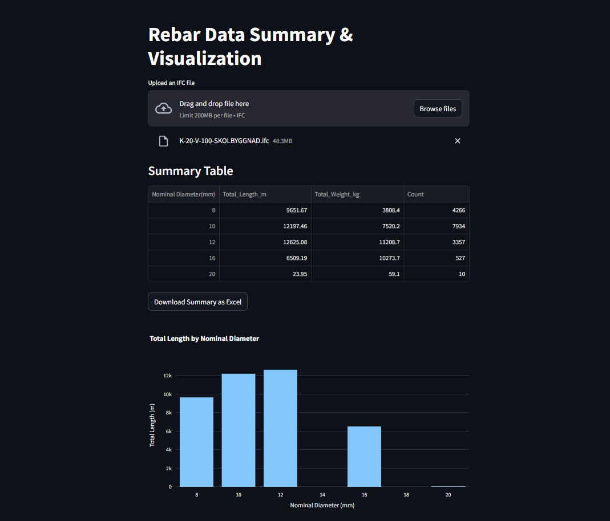

# Rebar Data Processing & Visualization App

This Streamlit app provides rapid cost estimation for reinforced concrete projects. It parses IFC files, extracts rebar quantity data (length and weight), and visualizes key metrics for quick analysis.

## Features
- **IFC File Upload**: Upload an IFC file to extract rebar details.
- **Data Refinement**: Extracts shape, steel grade, bend radius, and calculates estimated weight.
- **Summary Table**: Groups data by nominal diameter and provides total length, total weight, and count.
- **Interactive Plots**: Visualizes total length and total weight by nominal diameter using Plotly.
- **Export Option**: Download the summary table as an Excel file.
  
Below is image illustration of the app
1. This snapshot shows the file being loaded and summarizing the quantities of rebar. The summary can be downloaded in a properly formatted excel file.



3. This snapshot shows the charts displaying the total lenght needed for each reinforcement type (diameter) for the project


4. This snapshot shows the raw data extracted from the IFC file and can be downloaded.

 

## Installation

### Clone the Repository
```sh
git clone https://github.com/your-username/your-repo-name.git
cd your-repo-name

python -m venv venv
source venv/bin/activate  # On macOS/Linux
venv\Scripts\activate     # On Windows
pip install -r requirements.txt

streamlit run app.py

